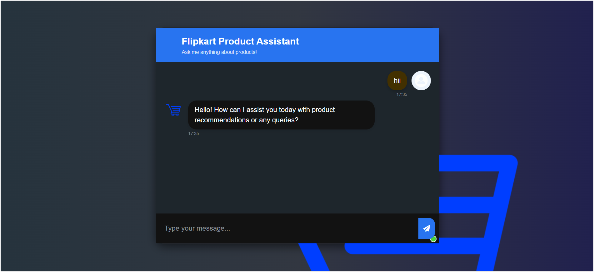

# SupportBot: A RAG‑Powered Customer Support Chatbot

A production-grade, end-to-end Retrieval-Augmented Generation (RAG) chatbot engineered for modern  buisnesses and organizations. By harnessing real customer reviews and cutting-edge generative AI, this system delivers accurate, empathetic support—24/7, at scale.

---

## Here’s a preview of the app’s user interface:


---

## 🔧 Core Workflow

1. **Review Extraction**  
   Pulls structured and unstructured product reviews from MongoDB.

2. **Vectorization & Ingestion**  
   Encodes review text into dense embeddings and indexes them in AstraDB for lightning-fast semantic search.

3. **Context-Aware Reasoning**  
   Retrieves the most relevant review vectors and feeds them to an LLM, grounding replies in actual user feedback.

4. **Real-Time Chat API**  
   Serves REST and WebSocket endpoints via FastAPI, running on Uvicorn for sub-200 ms response times under heavy load.

---

## ✅ Key Capabilities

- **Review-Grounded Conversation**  
  Delivers answers anchored in your customers’ own words—product fit, usage tips, troubleshooting, and more.  
- **Modular, Scalable Architecture**  
  Decoupled ingestion, indexing, and inference layers make customization and horizontal scaling trivial.  
- **Production-Ready Best Practices**  
  Dockerized services, health checks, structured logging, and centralized metrics (Prometheus/Grafana).  
- **Extensible AI Stack**  
  Swap LLM providers or vector stores with minimal code changes.

---

## 🚀 Deployment & CI/CD

- **GitHub Workflows**  
  Automated build, test, and push pipelines for every commit.  
- **AWS ECR**  
  Hosts Docker images in a secure, versioned registry.  
- **AWS App Runner**  
  Auto-scales containerized services—zero infra management, built-in HTTPS.  
- **Environment-Driven Configuration**  
  Pass secrets and endpoints via environment variables (`ASTRADB_ENDPOINT`, `ASTRADB_TOKEN`, `MONGODB_URI`, `GROQ_API_KEY`, `GOOGLE_API_KEY`, `HF_TOKEN`).

---
   
## 🏃 Running Locally

1. **Clone the repository**

   ```bash
   git clone https://github.com/hasan-raza-01/Customer-Support-System.git
   cd Customer-Support-System
   ```

2. **Set up environment variables**

   ```bash
   cp .env.example .env
   # Edit .env with your API keys and endpoints
   ```

3. **Create Virtual environment & Install Python dependencies**

   ```bash
   pip install --upgrade pip uv
   uv venv 
   .venv\scripts\activate
   uv pip install -e .
   ```

4. **Run application**

   ```bash
   uv run app.py
   ```

6. **(Alternative) Docker**
  ***build***
   ```bash
   docker build -t support-bot:latest .
   ```
   ***run***
   ```
   docker run -p 8000 support-bot:latest
   ```
